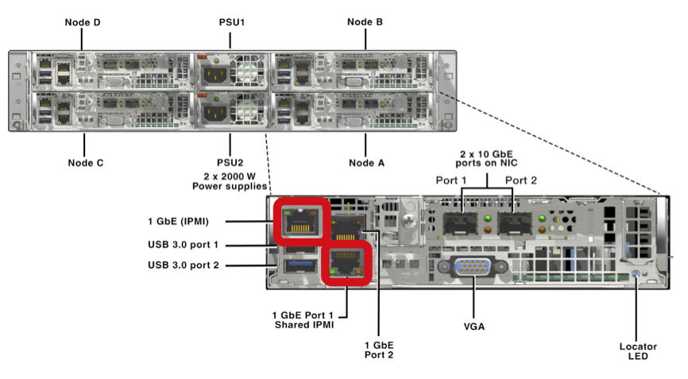

Setting Up
==========

IP Addressing
+++++++++++++

Before attending site to deploy the nodes you would have previously discussed the IP address range(s) that will be used with the customer. Commonly a spreadsheet similar to these examples (`AHV`_, `VMware vSphere`_, `Hyper-V`_) is used.

.. _AHV: https://drive.google.com/file/d/1zVrtEVnPwUeqqJJyh8DuYkSOHpbtwXpf/view?usp=sharing
.. _VMware vSphere: https://drive.google.com/file/d/1KED5yA0E3Y0FdAB1DnrFFa4btZlJYFfb/view?usp=sharing
.. _Hyper-V: https://drive.google.com/file/d/17Ac0CXMZnVUU5IjlqDHZeoFG9y2KjlD9/view?usp=sharing

To mitigate headaches and stress it's always suggested to use a flat IP scheme when running Foundation and when possible, avoiding VLANs. *VLAN tag application during the build my require additional configuration to your network switch*

Allocate IP addresses to your environment, for example:

-  Your computer

-  The Foundation VM

-  (optional) A Windows VM for older nodes that require Java for the IPMI

Assign these IP addresses and perform 'ping' tests to ensure communications are working as expected.

Nodes
+++++

Begin with the hardware configuration.

-   Make a note of the **IPMI** MAC address of each node, use your camera phone - take a photo

-   Plug **only** your switch and your computer into the node(s)

-   Disconnect **any** 10GbE cables, making a note of their positions before doing so

-   (Optional) Assign an IP address to one of the node's IPMI ports and conduct a 'ping' test

-   Connect cables to the IPMI **and** NIC 1 port, don't rely on using only the shared NIC port

