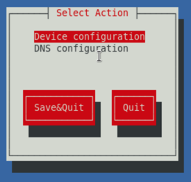

Foundation
==========

Running Foundation is straight forward, follow these steps:

Set Foundation VM IP
++++++++++++++++++++

Power on the VM (if it's not already running), click **nutanix**. Enter the default password (**nutanix/4u**) and click **Log In**.

Double-click **set_foundation_ip_address > Run in Terminal**.

Select **Device configuration** and press **Return**.

Select **eth0** and press **Return**.

.. figure:: images/03.png

.. note:: Use the arrow and tab keys to navigate between menu items, Enter to select.

Using your pre-allocated IP address discussed in the previous section, fill out the following fields, select **OK** and press **Return**:

- **Use DHCP** - Press **Space** to de-select
- **Static IP** - *<foundation_VM_IP>*
- **Netmask** - 255.255.255.128
- **Gateway** - *<Gateway IP>*

Select **Save** and press **Return**.

Select **Save & Quit** and press **Return**.

The network stack should restart itself to apply to the static IP you've assigned. Perfrom a 'ping' test to check communications between the VM and your computer.

Upload files into VM
++++++++++++++++++++
The files you've downloaded will need to be uploaded into the Foundation VM, use one of these methods to complete the transfer:

-   SCP from the command line on your MacBook

*Example :*
``scp the_filename.something nutanix@ip.address.of.foundation.vm:/home/nutanix/foundation``

-  Tools such as FileZilla, WinSCP, etc...

-  If you've used the Foundation pre-configuration option don't forget the JSON file

Connecting to Foundation
++++++++++++++++++++++++

It is recommended to use the web browser on your computer to run Foundation rather than within the VM itself.

Open **\http://<foundation_VM_IP>:8000/gui/index.html** in your browser to access Foundation.

Follow the UI, it's quite self-explanatory. If the nodes aren't automatically discovered then use the MAC addresses of the IPMI ports that you noted down previously.

**AVOID** using the multi-homing option where possible, less complexity reduces issues.

Problems?
+++++++++
A common problem is that the IPMI cannot be configured, this halts the build process, and is commonly due to a VLAN tag being applied. For some reason SuperMicro do not provide an option in the BIOS to apply or remove a tag, this can only be completed via the IPMI's webpage.

-   Manually set IPMI IP using locally attached keyboard via BIOS boot, ping from your computer

-   Follow KB 2027 to reset from ESXi and Hyper-V hypervisors

-   KB 7152 explains how to reset when no hypervisor is installed

-   KB 8123 Further details and syntax to support above to articles

-   Read the log files

-   Check and search the #foundation Slack channel
