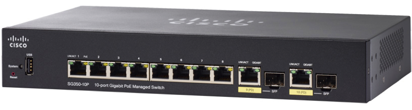
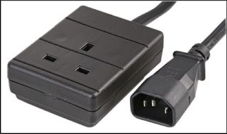
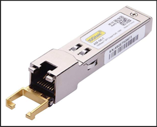

Hardware Kit Bag & Essentials
=============================
A few pointers to start your journey on being a Foundation expert

The network switch
++++++++++++++++++

-  **Don't** buy a cheap switch but don't go overboard

-  Think about the number of ports you need

- Each node needs 2 x NICs connected

- Your computer needs 1 x NIC

- You don't need to image a whole block at once

Cables
++++++

-  Plenty of options on eBay and they can be cheaper

-  8 x 1m for the switch to the nodes

-  Use electrical tape to colour code the pairs of cables (or buy different colour cables), useful for troubleshooting

-  1 x 3m or 5m cable in a different colour

Power
+++++

-   A single 4-way block

-   An IEC C14 (PDU) to a 3-pin socket, useful when working with kit in a rack

Random other
++++++++++++

   
-   1GbE GBICs for nodes without RJ45 network ports, example here `GBIC`_.

-   Sandwich ties to label cables that may have already been presented by customer

-   Pack of foam ear-plugs

-   Small pair of scissors

-   Woolly hat

.. _GBIC: https://www.amazon.co.uk/gp/product/B01H4VFZ2K/ref=ppx_yo_dt_b_asin_title_o08_s00?ie=UTF8&psc=1
